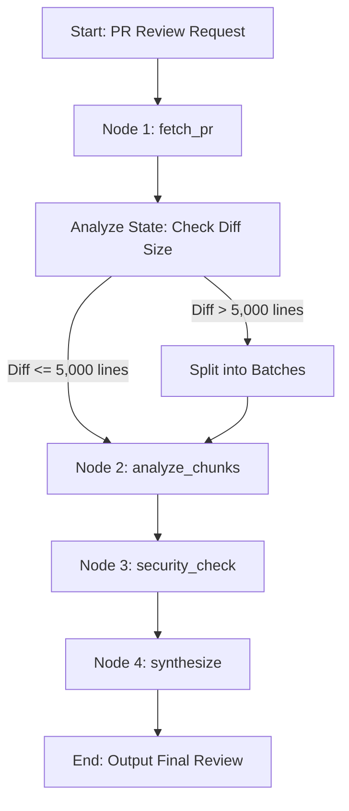

# AI Code Review Agent

> An autonomous code review platform that analyzes GitHub pull requests using LangGraph.js and large language models.

[](https://nextjs.org/)
[](https://opensource.org/licenses/MIT)

## Why This Exists

Manual code reviews are time-consuming, prone to human error, and often miss subtle security vulnerabilities when diffs become too large. This agent automates the initial review pass by breaking down massive pull requests into manageable chunks, performing targeted security audits, and delivering inline, actionable feedback. This allows human reviewers to focus on high-level architecture rather than catching typos or standard security flaws.

## Quick Start

Get the agent running locally in under a minute:

```bash
git clone https://github.com/yourusername/ai-code-review-agent.git
cd ai-code-review-agent
npm install
cp .env.example .env
```

Open `.env` and fill in your GitHub OAuth and LLM provider credentials.

```bash
npm run dev
```

The dashboard will be available at [http://localhost:3000](http://localhost:3000).

## Installation

**Prerequisites**:
- Node.js 18+
- npm 9+
- A [GitHub OAuth Application](https://github.com/settings/developers) (for authentication)
- An OpenAI API Key (or alternative LLM provider key supported by LangChain)

## Configuration

To enable user authentication and allow the agent to fetch pull requests, you must configure a GitHub OAuth app:

1. Go to **GitHub Settings** -> **Developer settings** -> **OAuth Apps** -> **New OAuth App**.
2. Set the **Homepage URL** to `http://localhost:3000`.
3. Set the **Authorization callback URL** to `http://localhost:3000/api/auth/callback/github`.
4. Copy the generated **Client ID** and **Client Secret** into your `.env` file.

| Environment Variable | Description |
|----------------------|-------------|
| `GITHUB_ID`          | Your GitHub OAuth App Client ID |
| `GITHUB_SECRET`      | Your GitHub OAuth App Client Secret |
| `NEXTAUTH_URL`       | The canonical URL of your site (e.g., `http://localhost:3000`) |
| `NEXTAUTH_SECRET`    | A random string used to hash tokens and sign cookies |

## Architecture Workflow

The reviewing workflow is orchestrated using **LangGraph.js**, moving structured state through four dedicated steps (nodes):



1. **`fetch_pr`**: Retrieves metadata and raw diffs from the GitHub REST API.
2. **`analyze_chunks`**: Splits complex diffs into manageable file chunks and processes them in parallel to respect context limits.
3. **`security_check`**: A targeted analysis pass for identifying security vulnerabilities (e.g., hardcoded secrets, injection flaws).
4. **`synthesize`**: Aggregates all findings, resolves conflicting recommendations, and outputs a final verdict (`Approve`, `Request Changes`, or `Comment`).

## License

MIT License
